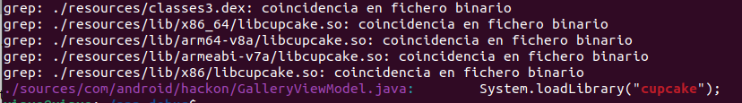

# Cupcake

After we've completed the second challenge, we can take a quick look at the application and find a second activity or view named "Relax Time." In this section, we encounter the following message, which coincides with the challenge's hint about desiring a cupcake.

<table align="center" style="border-collapse: collapse; border: 4px solid #000;">
  <tr>
    <td style="padding: 5px; text-align: center;">
      
    </td>
  </tr>
</table>

We can quickly inspect the code and notice that the GalleryViewModel class has loaded a native C library. The string displayed in this view is obtained from this library. With the hint of baking a cupcake in mind, we can proceed to explore the contents of the library to uncover any interesting details. To do so, we'll decompile the APK using jadx (not jadx-gui). After decompiling, we can use grep to search for related information about the 'cupcake' library. We find a file named libcupcake.so, which is a binary library. Since libcupcake.so is a binary file, we can utilize Ghidra to reverse engineer its code.

<table align="center" style="border-collapse: collapse; border: 4px solid #000;">
  <tr>
    <td style="padding: 5px; text-align: center;">
      
    </td>
  </tr>
</table>

<table align="center" style="border-collapse: collapse; border: 4px solid #000;">
  <tr>
    <td style="padding: 5px; text-align: center;">
      
    </td>
  </tr>
</table>

Once we have Ghidra opened, we can locate the function named "recipe". 

<table align="center" style="border-collapse: collapse; border: 4px solid #000;">
  <tr>
    <td style="padding: 5px; text-align: center;">
      
    </td>
  </tr>
</table>

As we can see, the instructions are divided into steps, and the main sentences are encoded in base64. We can use any online tool to decode the sentence, and we obtain the following text: 

Preheat your oven to 350°F (175°C). Line a muffin tin with cupcake liners. In a medium bowl, whisk together the <strong>flour</strong>, <strong>baking powder</strong>, and <strong>salt</strong>. Set aside. In a large bowl, cream together the softened <strong>butter</strong> and granulated <strong>sugar</strong> until light and fluffy. Beat in the <strong>eggs</strong>, one at a time, then stir in the <strong>vanilla</strong> extract. Gradually add the dry ingredients to the wet ingredients, alternating with the <strong>milk</strong>, beginning and ending with the dry ingredients. Mix until just combined.Divide the batter evenly among the cupcake liners, filling each about two-thirds full.Bake in the preheated oven for 18-20 minutes, or until a toothpick inserted into the center comes out clean.DO YOU LIKE MY RECIPE?Remove from the oven and let the cupcakes cool in the pan for a few minutes before transferring them to a wire rack to cool completely.Once cooled, you can frost the cupcakes with your favorite frosting and decorate as desired. Enjoy your homemade cupcakes!These cupcakes are best enjoyed fresh, but you can store them in an airtight container at room temperature for up to 3 days.

We can infer that to obtain the flag, we should follow the instructions. At the same time, we observe some interesting functions like butter, egg, and flour, all of which are ingredients of the cupcake, and each seems to attempt to print something. Therefore, if we follow the instructions and order these chunks of characters based on the order of these ingredients as they appear in the text. 

<table align="center" style="border-collapse: collapse; border: 4px solid #000;">
  <tr>
    <td style="padding: 5px; text-align: center;">
      
    </td>
  </tr>
</table>

<table align="center" style="border-collapse: collapse; border: 4px solid #000;">
  <tr>
    <td style="padding: 5px; text-align: center;">
      
    </td>
  </tr>
</table>

*Important, we need to eliminate the backslash symbol, which is used in C to interpret special characters. 

<pre style="font-size: 1.2em; margin: 0; padding-left: 0;">
<code style="font-size: 2em; display: inline-block; text-align: center;">87?\"D:MtMU1NI(`@ru\'fF`:hICGT=&lt;1Lk-&lt;AR@/L?Y\&quot;:hCF=11Eb/`8E&amp;2n</code>
</pre>

<pre style="font-size: 1.2em; margin: 0; padding-left: 0;">
<code style="font-size: 2em; display: inline-block; text-align: center;">87?"D:MtMU1NI(`@ru'fF`:hICGT=&lt;1Lk-&lt;AR@/L?Y":hCF=11Eb/`8E&amp;2n</code>
</pre>

Finally, we have the string. It appears to be encoded, though not in the same manner as base64. Using the magic function of CyberChef, we can take a closer look. And yep, now we have our flag! 

<table align="center" style="border-collapse: collapse; border: 4px solid #000;">
  <tr>
    <td style="padding: 5px; text-align: center;">
      
    </td>
  </tr>
</table>

*Author: Lamp*
