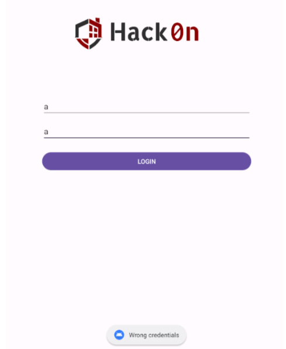
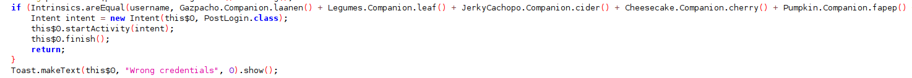
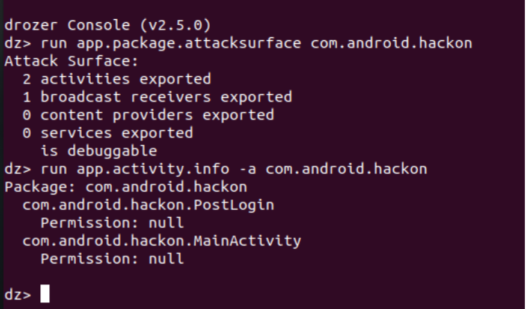
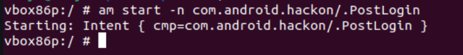
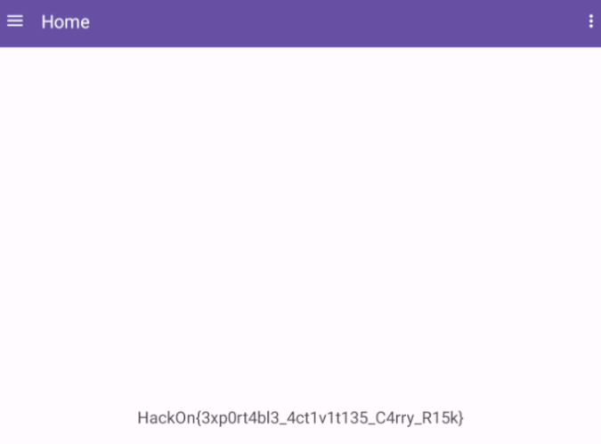

# Dive Into The Secret

  As the statement says, to uncover the secret we need to get inside, and after the first challenge, we are in front of a login panel, so we can surmise that to obtain the second flag, we need to bypass the login panel. 

<table align="center" style="border-collapse: collapse; border: 4px solid #000;">
  <tr>
    <td style="padding: 5px; text-align: center;">
      
    </td>
  </tr>
</table>

After analyzing the code, we observe that the application compares the provided username and password with a set of characters returned by various classes. If the provided credentials are correct, the MainActivity will call another activity named PostLogin. However, considering the tediousness of deobfuscating the code, which is not the primary intention of this challenge, we can use another powerful tool, drozer, to gain a general understanding of the application. 

<table align="center" style="border-collapse: collapse; border: 4px solid #000;">
  <tr>
    <td style="padding: 5px; text-align: center;">
      
    </td>
  </tr>
</table>
We can run these two commands using drozer.

<pre style="font-size: 1.2em; margin: 0; padding-left: 0;">
<code style="font-size: 2em; display: inline-block; text-align: center;">run app.package.attacksurface com.android.hackon</code>
</pre>

<pre style="font-size: 1.2em; margin: 0; padding-left: 0;">
<code style="font-size: 2em; display: inline-block; text-align: center;">run app.activity.info -a com.android.hackon</code>
</pre>

We can see in the following image, the tool has discovered two exportable activities, one of them being PostLogin, which is the activity we observed in the previous code and quite suspicious. Since it is exportable, we can invoke this activity using adb. 

<table align="center" style="border-collapse: collapse; border: 4px solid #000;">
  <tr>
    <td style="padding: 5px; text-align: center;">
      
    </td>
  </tr>
</table>

To trigger the activity, we can simply open adb shell in the terminal and enter the following command to invoke it.

<pre style="font-size: 1.2em; margin: 0; padding-left: 0;">
<code style="font-size: 2em; display: inline-block; text-align: center;">adb shell
am start –n com.android.hackon/.PostLogin</code>
</pre>
  
<table align="center" style="border-collapse: collapse; border: 4px solid #000;">
  <tr>
    <td style="padding: 5px; text-align: center;">
      
    </td>
  </tr>
</table>

We can observe that after invoking the activity PostLogin, we are now inside, and on the home page, we have our flag. 

<table align="center" style="border-collapse: collapse; border: 4px solid #000;">
  <tr>
    <td style="padding: 5px; text-align: center;">
      
    </td>
  </tr>
</table>

*Author: Lamp*
