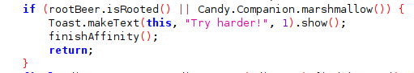
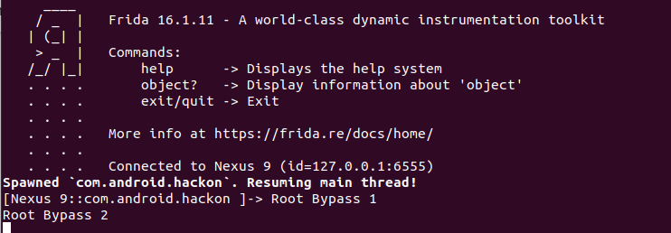
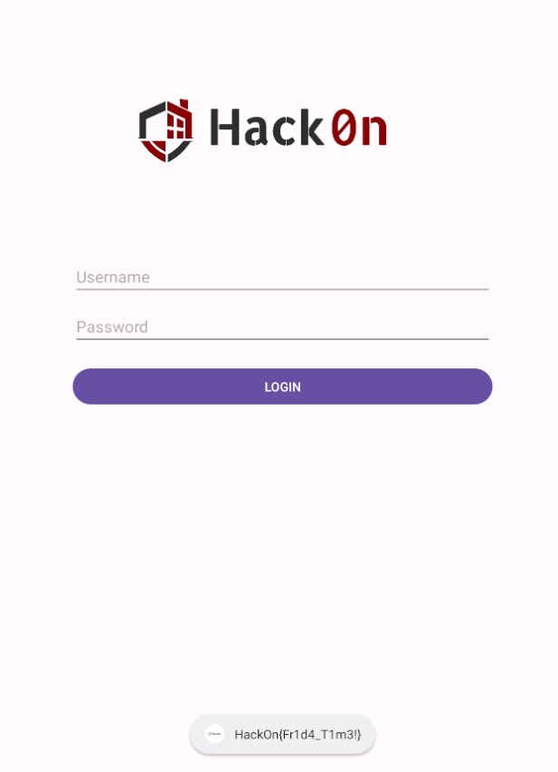

# Root To Victory
First, we need to install the application. We can achieve this by using adb. Execute the following command:

<pre style="font-size: 1.2em; margin: 0; padding-left: 0;">
<code style="font-size: 2em; display: inline-block; text-align: center;">adb install HackOn.apk</code>
</pre>

Once the application is downloaded, we can proceed to try opening it. However, upon doing so, it immediately closes, with a pop-up message appearing stating 'Try Harder!'.

<table align="center" style="border-collapse: collapse; border: 4px solid #000;">
  <tr>
    <td style="padding: 5px; text-align: center;">
      
    </td>
  </tr>
</table>

To gain a better understanding of how the application works, we can open it with Jadx.  Jadx will display the application in a disassembled structure. Then, we can search for the message 'Try harder!' 

<table align="center" style="border-collapse: collapse; border: 4px solid #000;">
  <tr>
    <td style="padding: 5px; text-align: center;">
      
    </td>
  </tr>
</table>

Once the string "Try harder!" is located within the MainActivity class, it indicates its association with a condition responsible for root detection. Essentially, if the device is rooted, the application will be closed. To bypass this root detection mechanism, we can use Frida to implement the functions rootBeer.isRooted and Candy.Companion.marshmallow, ensuring they consistently return false, regardless of conditions.

<pre style="font-size: 1.2em; margin: 0; padding-left: 0;">
<code style="font-size: 2em; display: inline-block; text-align: center;">Java.perform(function () {
      var root1 = Java.use('com.scottyab.rootbeer.RootBeer').isRooted;
      const root2 = Java.use('com.android.hackon.foods.Candy$Companion')
      root1.implementation= function(){
          console.log("Root Bypass 1");
          return false;
      };
      root2.marshmallow.implementation= function(){
          console.log("Root Bypass 2");
          return false;
      };
}); </code>
</pre>
      

This is the script that can be used to implement these previous functions. To execute this script with Frida, use the following command:

<pre style="font-size: 1.2em; margin: 0; padding-left: 0;">
<code style="font-size: 2em; display: inline-block; text-align: center;">frida -U -l script.js -f com.android.hackon</code>
</pre>
      
<table align="center" style="border-collapse: collapse; border: 4px solid #000;">
  <tr>
    <td style="padding: 5px; text-align: center;">
      
    </td>
  </tr>
</table>

After running the Frida script to bypass root detection, the app just opens up like usual. And guess what? We spot our desired flag popping up in a message!

<table align="center" style="border-collapse: collapse; border: 4px solid #000;">
  <tr>
    <td style="padding: 5px; text-align: center;">
      
    </td>
  </tr>
</table>

*It's important to note that the device where the application is installed must be rooted. If not, the application will open, but the flag won't be displayed. This is why the statement of this challenge says " in orde to win, you gonna need some privileges". This measure prevents players from simply installing the application on their own mobile devices to obtain the flag. 

 
*Author: Lamp*
