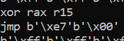

# K1ngOfStructures
Para la resolución de este reto se nos proporcionan diferentes archivos comprimidos en "K1ngOfStructures.zip" ``md5 d88027e9df532dc812c3203bd1fa9bcb``

Cuando descomprimimos el archivo se obtiene:
    - main ``md5 88aa23cb0fdec3da1d20a92d274483d9``
    - file ``md5 68fbee3060ed2ac5c2f8f6b5b8eed7d6``

## Previous checks
Comprobando el archivo main mediante el comando ``$ file main`` obtenemos:

``main: ELF 64-bit LSB pie executable, x86-64, version 1 (SYSV), dynamically linked, interpreter /lib64/ld-linux-x86-64.so.2, BuildID[sha1]=eedb7f4ee2a66bc47ef4d4c2ebc1e95229aeb341, for GNU/Linux 3.2.0, with debug_info, not stripped``

## Decompiling - IDA PRO
Mediante las funciones que nos muestra IDA, rápidamente podemos darnos cuenta de que es una VM que interpreta el archivo ``file``.

En primer lugar, inspeccionaremos las funciones relativas a la vm: ``new_vm``, ``close_vm``, ``run_vm``, ``step_next_instruction`` y ``get_reg``, dandonos cuenta de diferentes cosas:
- En ``step_next_instruction`` encontramos una llamada a la variable "opcode_table" con el byte >> (8 + 16).

- Conociendo el valor alocado y dealocado de 4096 y que en la función next_instruction se comprueba que *(a1 + 16) < 1024, podemos deducir que el tamaño de instrucción es de 4byte (32bit).

Conociendo los opcodes, necesitaremos analizar las diferentes funciones para conocer el número de registros implicados en los mismos:
- En las funciones ``printc`` y ``readc`` podemos comprobar que únicamente se recibe un registro con offset en el 3 byte. (El ultimo es el opcode).

- En las funciones ``add``, ``sub``, ``xor``, ``mv`` y ``even`` encontramos que se utilizan 2 registros con offset en el 2 y 3 byte:

- En las funciones ``je``, ``jne``, ``jg`` y ``jl`` encontramos que se utilizan 2 registros con offset en el 2 y 3 byte, siendo el primero para el offset al que saltar:

- La función ``jmp`` recibe un inmediato, comprobando que este se encuentre dentro de memoria:

- La función ``hlt`` unicamente recibe el opcode:

Con este conocimiento, se puede generar un solver similar a **solve.py** el cual nos permite obtener el siguiente "assembly":

Analizandolo, podemos observar que en la línea 3 se realiza un ``ld r9 0018``, por tanto, se encuentra cargando en r9 el contenido de la posicion 24 (decimal). Carga en rax otra posición "ld rax 'd'" que es 0x64 en hexadecimal.

**xor key:**

**content:**

.

Conociendo esto, podemos redefinir el **solver.py** añadiendo la parte de que descifre esta segunda parte del shellcode.

Una vez descifrado, en el offset 'd' 0x64 encontramos la siguiente rutina (rutina1):

Como podemos comprobar, se carga información de un offset raro, se realiza una comparación de rcx y se salta a diferentes offsets.

Estos offsets se corresponden con:

Si comprobamos la rutina a la que se salta después de realizar las operaciones sobre los valores:

- Esta rutina como se puede ver, resta los valores de rax y rdi (rax valor leido en la primera rutina sobre el que se han aplicado operaciones) (rdi valor cargado de offset) y se comprueba que sea 0, es decir, se comprueba que ambos registros tengan el mismo contenido. 
- Se actualiza sumando 1 a los valores de un offset de la rutina1, y se salta a la misma.

Si comprobamos el offset del valor cargado en rdi encontramos:

Debido a que ha interpretado 000000<valor> como opcode / registro. 

Si lo vemos mediante xxd vemos los valores:

    

Por tanto, conociendo el funcionamiento del shellcode, podemos modificar el **solver.py** para que descifre la flag que hemos obtenido del xxd:

Trás la ejecución:

# Flag
``HackOn{tir3d_0f_check1ng_struct_valu3s_}``