# PICTureThis
Para la resolución de este reto se nos proporcionan diferentes archivos comprimidos en "K1ngOfStructures.zip" ``md5 e3788cee24081f2860efe89b21fa5be8``

Cuando descomprimimos el archivo se obtiene:
    - exe ``md5 d2c6ff4f269048a1c2beb7cf66d62756``
    - dll ``md5 ecb484a7d9eedf374fb6a06f6a410761``

## Previous checks
Comprobando el archivo main mediante el comando ``$ file main.exe`` obtenemos:

``main.exe: PE32+ executable (console) x86-64 (stripped to external PDB), for MS Windows``

## Decompiling - IDA PRO
En primer lugar debemos de buscar la función ``main`` desde ``start``, siendo esta la función ``sub_14000243f()``.

Como podemos comprobar, se declaran diferentes variables al principio de la función:

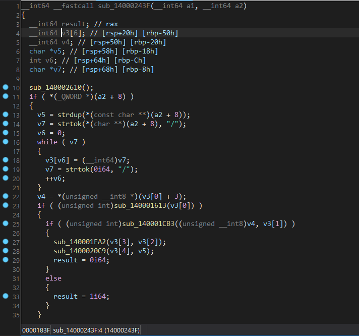

Que se pueden rapidamente sustituir:

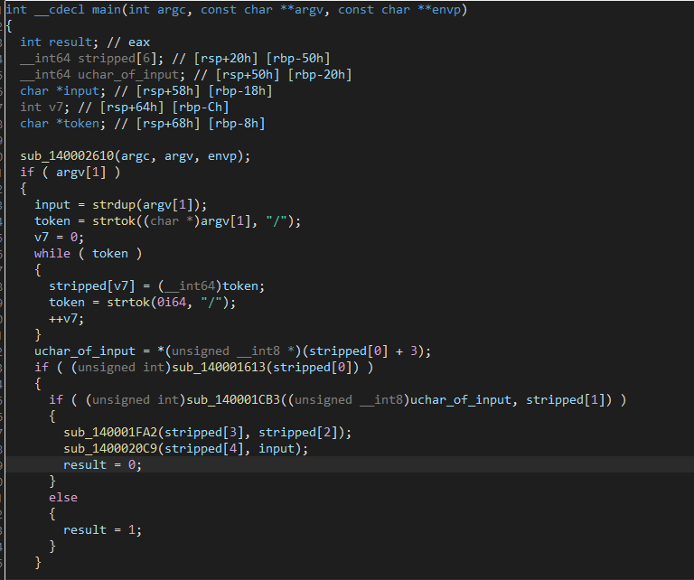

Por tanto, sabemos que el main en primer lugar secciona el input en diferentes partes separadas por "/", almacenandolas en una estructura de 6 elementos.
- Input: aa/bb/cc/dd/ee/ff

### Stage I
La primera función a la que se llama es ``sub_140001613()``:

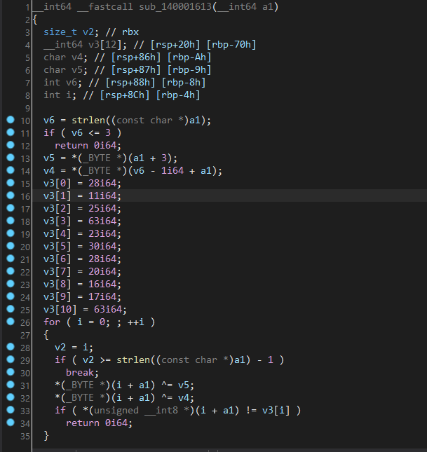

Renombrando algunas de sus variables...

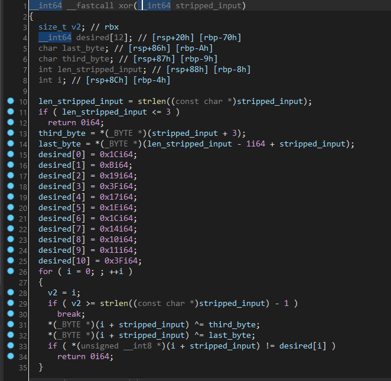

Como podemos comprobar en la imagen, esta función realiza el xor de la primera parte del input "aa" con su 3 carácter y su último caracter (este no se modifica). Por el momento se desconoce este 3º caracter.

Volviendo al main, podemos comprobar que este 3 carácter también se le pasa a la segunda función que se llama, como primer parámetro.

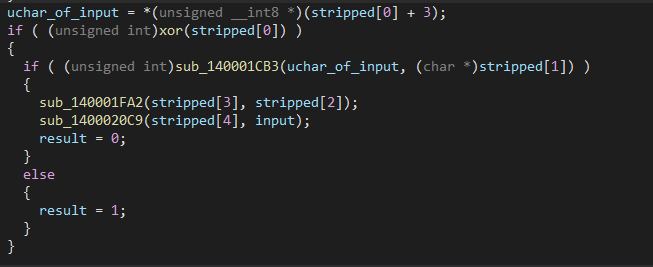

### Stage II
Entrando en la segunda función, ``sub_140001cb3()``, vemos que pasan diferentes cosas:

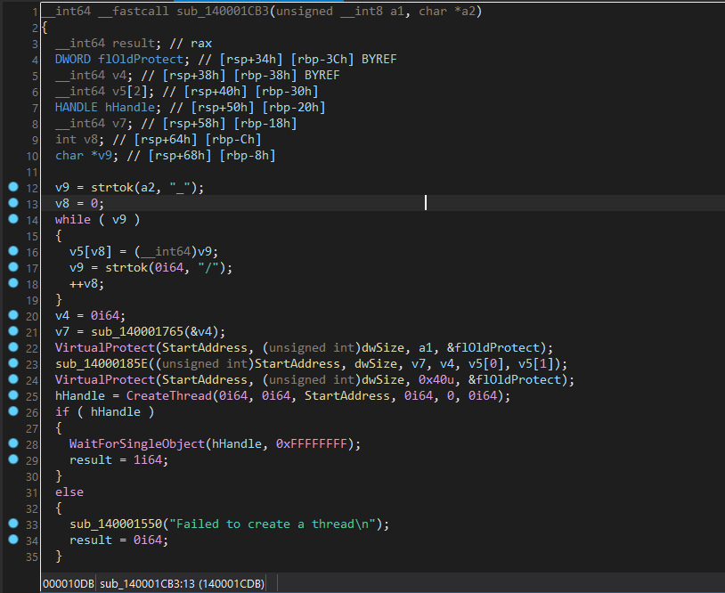

1) Se vuelve a realizar input stripping separado esta vez por _
2) Se llama a otra función ``sub_140001765()`` con v4 y se recoge el valor de retorno en v7
3) Se llama a VirtualProtect con el primer parámetro recibido (comentado anteriormente)
4) Se llama a otra función ``sub_1400018e5()`` con v7, v4 v5[0] y v5[1]
5) Se cambian de nuevo las protecciones de memoria y se ejecuta el algo

De la llamada a VirtualProtect con el input del usuario podremos deducir el valor 0x40 (PAGE_EXECUTE_READWRITE), que se corresponde con el carácter @.

Hasta ahora tenemos: ``ctf@hackon?/bb/cc/dd/ee``

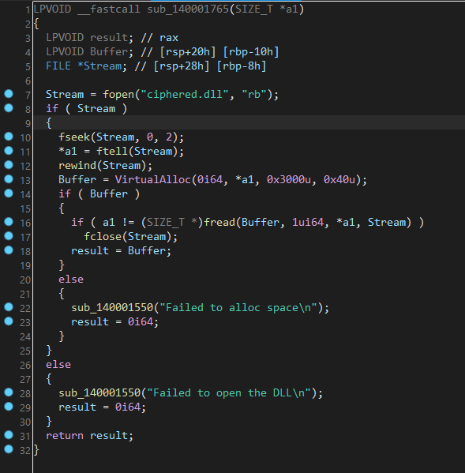

Si entramos en ``sub_140001765()`` nos daremos cuenta que esta función únicamente lee la dll que se da en el reto y revuelve en v4 su tamaño.

Si entramos en la función ``sub_1400018e5()``, nos daremos cuenta de que esta función modifica valores de una posición de memoria en función de los parámetros recibidos
- En primer lugar se buscan 8 0x88 y se modifica por dll (handle / puntero a la dll leida)
- En segundo lugar se modifica stripped_2[0] 
- Por último se modifica stripped_2[1]

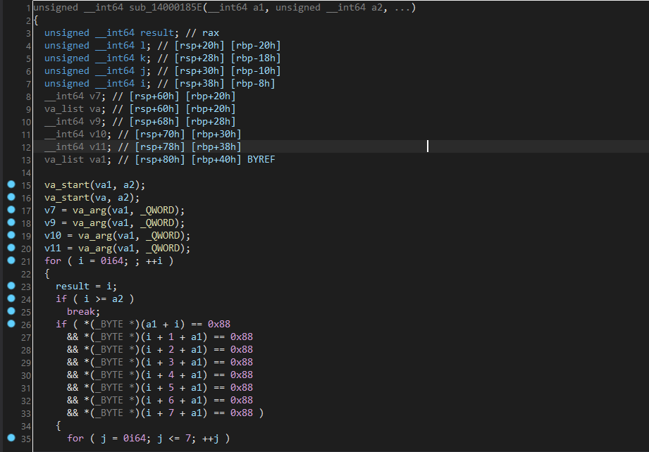

Mirando en las referencias cruzadas de dicha dirección de memoria encontramos lo siguiente en .data:

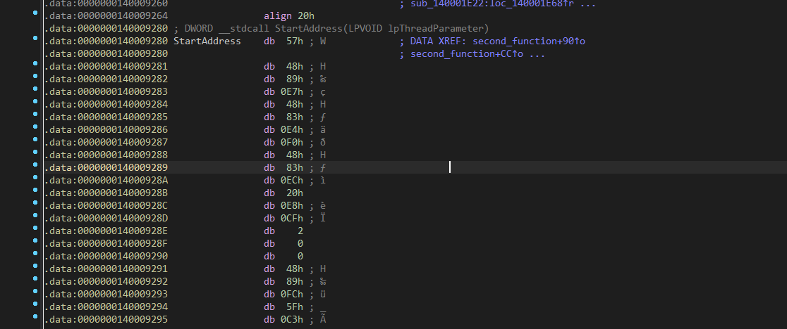

Cuyo bytecode deberemos extraer a un archivo .bin para analizarlo.

Renombrando las variables de la función ``sub_140001cb3()`` tenemos:

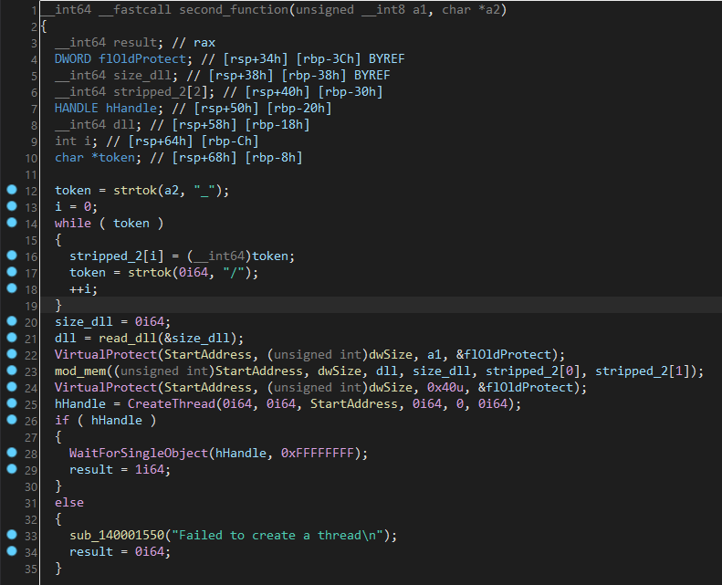

### Decompilación Shellcode - IDA PRO
En el shellcode obtenido encontramos 4 funciones: ``sub_20()``, ``sub_b0()``,  ``sub_180()``, ``sub_2e0``.

La función importante a analizar es ``sub_2e0()``, en la que encontramos lo siguiente:

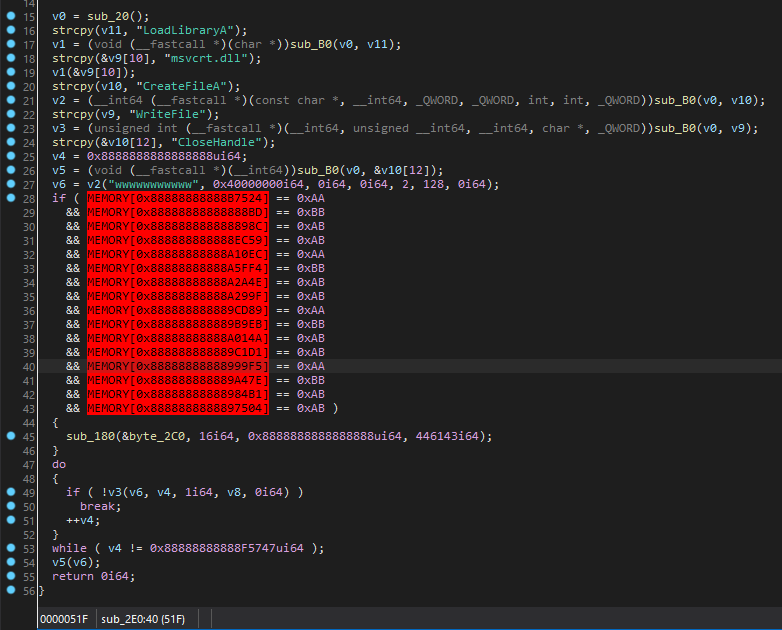

Como se observa, se comparan una serie de posiciones de memoria con 0xaa, 0xbb... Estos valores son los que han sido sustituidos anteriormente por "stripped_2[0]", por tanto, sabemos que los valores de estos deberán coincidir con MEMORY...

Esto son posiciones de memoria que, por como se encuentran definidas (0x88 88 88 88 88), es bastante probable que sea el 0x88, 0x88, ... que se ha sustutuido anteriormente por dll, por lo que podemos deducir que MEMORY es realmente el puntero a dll.

Para obtener las posiciones de la dll deberemos restar el offset a 88888888...

Por ejemplo:
0x8888888888888888 - 0x88888888888b524 -> 2ec9c -> 191644.

Realizando lo mismo con todas las posiciones e imprimiendo las mismas de la .dll cifrada, obtenderemos el string requerido: **password.c**

Input string: ``ctf@hackon?/d0n0t8ruT3,th1nk_bb/cc/dd/ee``

v6 se corresponde con stripped_2[1], puesto que (no me pregunteis porque), IDA ha decidido mostrar la cadena sustituida anteriormente (0x77, 0x77, ...) por 'www...'.

Por tanto, sabemos, y si probamos con la contraseña obtenida, podremos comprobar, que stripped_2[1] es el nombre del archivo bajo el cual se descifra la .dll.

## Decompiling main - IDA PRO
De vuelta al main, podemos comprobar la siguiente función a la que se llama ``sub_140001fa2()``.

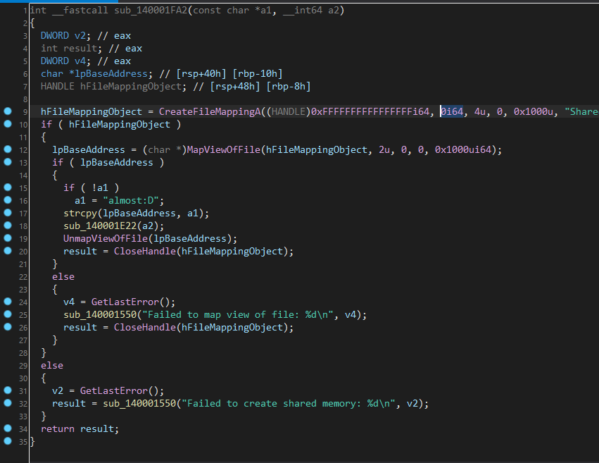

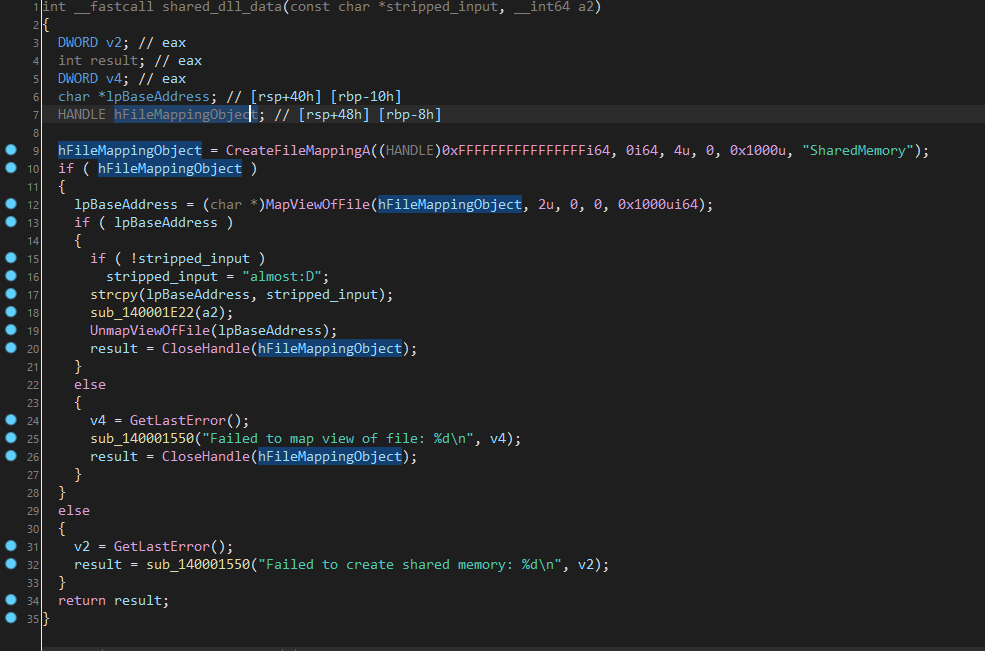

Esta función copia parte del input en una región de memoria compartida y llama a otra función ``sub_14001e22(a2)``

Esta función realiza un xor de una zona de memoria para después ejecutarla.

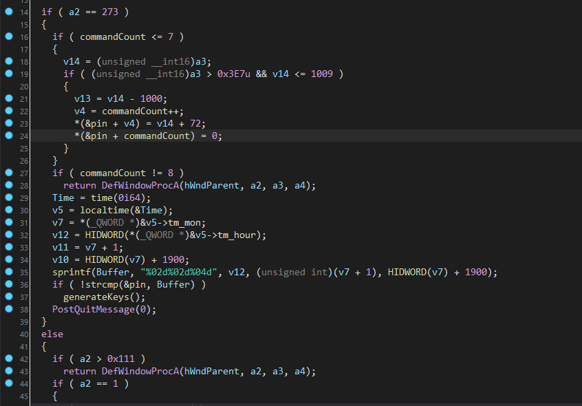

Si extraemos dicha zona de memoria: **mod_bytes**
- Se realiza xor 0x33
- Se modifican por una serie de bytes (a2)

Para obtener dichos bytes, después de hacer el xor, necesitaremos ver el bytecode del shellcode para ver las posiciones por las que se esta modificando algo: 147, 474, etc. Y recuperar los valores correctos. 

Deberemos entender que el shellcode únicamente actua como LoadLibrary de un string hardcodeado.
En este caso el valor a recuperar es ``Magic``, recuperado de 5 posiciones diferentes.

Por tanto, un input válido hasta ahora sería: ``ctf@hackon?/d0n0t8ruT3,th1nk_bb/Magic/dd/ee``

Una vez modificado, utilizando el comando ``$ strings shellcode2.bin`` podemos ver "burpees.dll", que es el nombre del salida de la dll que necesitabamos anteriormente.

Input válido: ``ctf@hackon?/d0n0t8ruT3,th1nk_burpees.dll/Magic/dd/ee``

### Decompiling dll - IDA PRO
Al decompilar la .dll hay dos rutinas que nos importan principalmente:
- WindowProc
- generateKeys, swap, permutateDictionary, decryptBuffer 

Al ejecutar la dll como parte de la cadena del proceso, se nos pide un PIN code.

En la función ``WinProc`` encontramos diferentes cosas:
1) Hay un contador hasta 8.
2) Se obtiene la fecha actual dd/mm/yyyy
3) Se compara con la formada con el PIN

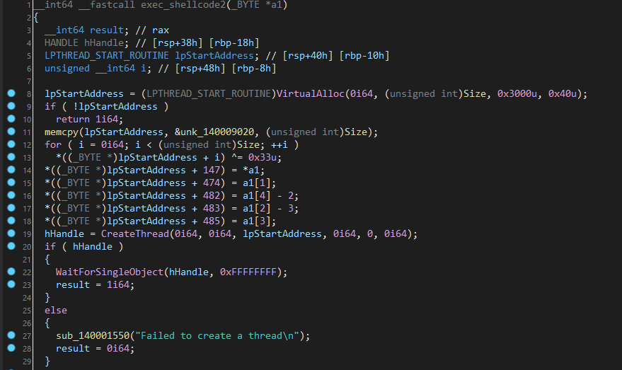

Por tanto, para saltarnos este primer check deberemos de introducir la fecha en la que se juegue el CTF (solo válido hasta 19, sorry :))

Por su lado, la función ``generateKeys()`` realiza diferentes funciones:
1) Recibe la shared data del binario
2) Crea un diccionario hardcodeado
3) Genera una key (v3) de 32 bytes para AES
4) Realiza una serie de operaciones sobre el diccionario
5) Compara la data compartida con este string recuperado
6) En caso de que coincidan, descifra un buffer

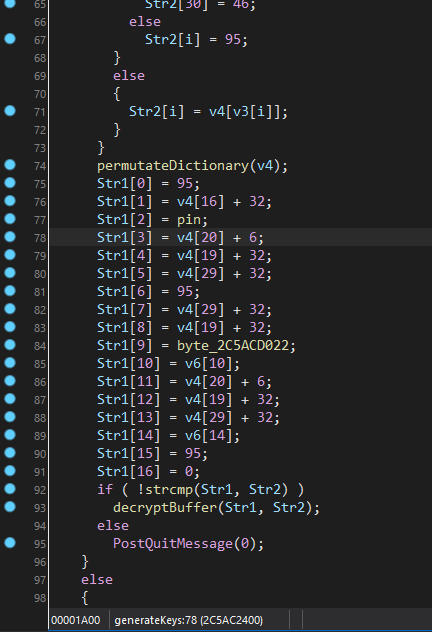

Por tanto, una vez entendidas las operaciones realizadas sobre el diccionario (dependientes del PIN), podemos realizar un "solver" que nos calcule la información necesaria: **generate_keys**

Input válido: ``ctf@hackon?/d0n0t8ruT3,th1nk_burpees.dll/Magic/_n1ght_th0ughts_/ee``

### Stage Final
Llegados a este punto ya tenemos el html descifrado, solo falta la reconstrucción de la flag.

Para ello, se lee un ultimo trozo (stripped[6]) y se compara con "end".

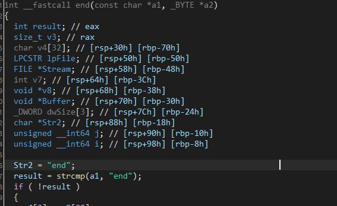

Input final: ``ctf@hackon?/d0n0t8ruT3,th1nk_burpees.dll/Magic/_n1ght_th0ughts_/end/``

# Flag
``HackOn{HackOn{_hag0_f0kin_n1ght_8urpees_}``