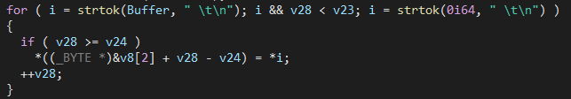

# Favela Ransomware 
Para la resolución de este reto se proporcionan diferentes arhcivos, comprimidos en "favela_ransomware.zip"
``md5``:``50fad83440bfb9c98340ee8a062c7506``.

Cuando se descomprime el archivo se obtiene:
    - favela_ransomware.exe         ``md5``:``e18317b122210278a93fd0bec0142a7c``.
    - flag.enc                      ``md5``:``e18317b122210278a93fd0bec0142a7c``.
    - note.txt                      ``md5``:``3d0f50f56e77ab0f08e4e58cbf4eaffc``.
    - ransomed.png                  ``md5``:``e6ac74fe52feda5b41e8b8ab595654dd``.
    - diary.txt                     ``md5``:``3024cd718bd8ba7c9376eb7d0ceda1e1``.
    - lia sikora desnuda.jpg        ``md5``:``c099d4dbd9da475ced1bc6490b3f717a``.

## Previous checks
Comprobamos el tipo de archivo mediante ``$ file favela_ransom.exe``, obteniendo:
``favela_ransom.exe: PE32+ executable (console) x86-64 (stripped to external PDB), for MS Windows``

## Decompiling - IDA Pro
Al decompilar el binario, encontramos que en la función ``sub140001717()`` ocurren diferentes cosas:
1) Se realiza una petición a gist/raw y se almacena en un buffer de 512 bytes


2) Encontramos el siguiente bucle:
    - Se tokeniza el buffer obtenido de la petición anterior mediante " \t\n"
    - Si nº token < 60 y nº >= 28: Almacena en v8 -> *i (primer caracter del token)



3) Encontramos v8[0] y v8[1], que son 16 bytes "hardcodeados", sobre los cuales se aplican las siguientes operaciones:
    - Si j < 0xf (15): v8 ^ 0x77. Por tanto, se esta realizando un xor a v8[0] y v8[1] mediante 0x77, que se guarda en v7.
    - Si k < 0x1f (16): v6 = v8[2]. Por tanto, se estan copiando los primeros 32 bytes de v8[2].
    - Se llama a la función ``sub_14000211f()"`` con v5 (sin utilizar), v6 y v7.


Si tenemos nociones básicas sobre cifrado, la recuperación de dos buffers de 16 y 32 bytes ya nos debería oler a AES. Adicionalmente, en la nota que se abre mediante la ejecución "note.txt" se indica que se han cifrado los archivos mediante AES256. En caso contrario deberemos de seguir reverseando x)

4) Vemos que se llama a una función con le parámetro "." y se comprueba su return value, que en caso de error, imprime "Error opening directory". Por lo que la podemos renombrar por opendir.

5) En el siguiente bucle, se comprueba que v19 (return value de  una función a la que se llama con v20 (return value de opendir)) sea diferente de "favela_ransom.exe", "ransomed.png" y "note.txt".
- En caso de ser así, se lee del buffer que retorna el abrir v19, comprueba su tamaño y aloca espacio en un buffer llamado "Block".
- Comprueba que el tamaño de este buffer sea múltiplo de 16.
    - Si es múltiplo de 16, llama a una función con el buffer, su tamaño (16) y v5 (return value de ``sub_14000211f()``)
    - En caso contrario, se llama a una función ``sub_1400165c()`` con el bloquue, su tamaño y dos valores de retorno.


6) En caso de decompilar la función ``sub_1400165c()`` nos damos cuenta de diferentes cosas:
- Se calculan una serie de bytes de padding
- Se optiene el heap
- Se realoca espacio para el buffer
- Se copia este padding en el buffer


Adicionalmente, si retorna error imprime "error padding buffer".

7) Mediante esta información, podemos entender el funcionamiento del binario:
- Lee un gist y obtiene las primeras 32 letas de las palabras 28 - 60. Obtienedo así la clave aes
- Descifra el IV mediante xor 0x77
- Abre el directorio actual y cifra los archivos que sean diferentes de "favela_ransomware.exe", "note.txt" y "ransomed.png" mediante AES256.

## Solver
```
#include <windows.h>
#include <wininet.h>
#include <stdio.h>
#include <dirent.h>
#include <stdlib.h>
#include "aes.h"

#define BUFFER_SIZE 512
#define MAX_WORDS 32
#define MAX_WORD_LENGTH 100

#define KEY_SIZE 32
#define IV_SIZE 16
#define MAX_WORD_LENGTH 100

BOOL PaddBuffer(IN PBYTE InputBuffer, IN SIZE_T InputBufferSize, OUT PBYTE* OutputPaddedBuffer, OUT SIZE_T* OutputPaddedSize) {

	PBYTE	PaddedBuffer        = NULL;
	SIZE_T	PaddedSize          = NULL;

	// calculate the nearest number that is multiple of 16 and saving it to PaddedSize
	PaddedSize = InputBufferSize + 16 - (InputBufferSize % 16);
	// allocating buffer of size "PaddedSize"
	PaddedBuffer = (PBYTE)HeapAlloc(GetProcessHeap(), 0, PaddedSize);
	if (!PaddedBuffer){
		return FALSE;
	}
	// cleaning the allocated buffer
	ZeroMemory(PaddedBuffer, PaddedSize);

	// copying old buffer to new padded buffer
	memcpy(PaddedBuffer, InputBuffer, InputBufferSize);
	
    // saving results:
	*OutputPaddedBuffer = PaddedBuffer;
	*OutputPaddedSize   = PaddedSize;

	return TRUE;
}

int main
(void)
{
    HINTERNET hInternet, hConnect, hRequest;
    BOOL bRet;
    DWORD bytesRead;
    char request_buffer[BUFFER_SIZE], aes_key[KEY_SIZE];
    char* token;
    int word_count = 0;
    int start_word = 28;                    // Starting word index
    int end_word = start_word + MAX_WORDS;  // Ending word index

    // Open Internet connection
    hInternet = InternetOpen(NULL, INTERNET_OPEN_TYPE_DIRECT, NULL, NULL, 0);
    if (hInternet == NULL) {
        printf("Failed to open Internet connection\n");
        return 1;
    }

    // Connect to the server
    hConnect = InternetOpenUrl(hInternet, "https://gist.github.com/jsdario/6d6c69398cb0c73111e49f1218960f79/raw", NULL, 0, INTERNET_FLAG_RELOAD, 0);
    if (hConnect == NULL) {
        printf("Failed to connect to the server\n");
        InternetCloseHandle(hInternet);
        return 1;
    }

    InternetReadFile(hConnect, request_buffer, BUFFER_SIZE, &bytesRead);
    InternetCloseHandle(hConnect);
    InternetCloseHandle(hInternet);


    token = strtok(request_buffer, " \t\n");
    while (token != NULL && word_count < end_word) {
        // If word_count is greater than or equal to start_word, store the first character
        if (word_count >= start_word) {
            aes_key[word_count - start_word] = token[0];
        }
        word_count++;
        token = strtok(NULL, " \t\n");
    }

    unsigned char aes_iv[16] = {0x28, 0x39, 0x47, 0x28, 0x01, 0x44, 0x47, 0x28, 0x1a, 0x47, 0x1b, 0x46, 0x19, 0x47, 0x04, 0x28};
    
    for (size_t i = 0; i < 16; i++)
    {
        aes_iv[i] = aes_iv[i] ^ 0x777;
    }

    BYTE pKey[KEY_SIZE];
    BYTE pIv[IV_SIZE];

    // cipher
    struct AES_ctx ctx;
    // Copy AES key and IV byte by byte
    for (size_t i = 0; i < KEY_SIZE; i++) {
        pKey[i] = aes_key[i];
    }
    for (size_t i = 0; i < IV_SIZE; i++) {
        pIv[i] = aes_iv[i];
    }

	// Initializing the Tiny-AES Library
	AES_init_ctx_iv(&ctx, pKey, pIv);

    printf("iv:\n");
    for (size_t i = 0; i < 16; i++)
    {
        printf("%c", aes_iv[i]);
    }

    printf("\nkey:\n");
    for (size_t i = 0; i < 32; i++)
    {
        printf("%c", aes_key[i]);
    }

    printf("\n");
    printf("Opening flag.enc...\n");
    FILE *fd = fopen("flag.enc", "rb");
    if (fd == NULL)
    {
        printf("failed to open the flag");
    }


    fseek(fd, 0, SEEK_END);
    unsigned long size = ftell(fd);
    rewind(fd);


    unsigned char* buffer = (unsigned char*) malloc(size);
    if (fread(buffer, size, 1, fd) != size)
    {
        fclose(fd);
    }
    unsigned char* padded;
    size_t* padded_size;
    FILE* fp = fopen("flag.txt", "wb");
    if (buffer != NULL)
    {
        if (size % 16 != 0)
        {
            // Padding required, pad the buffer
            PaddBuffer(buffer, size, &padded, &padded_size)) 
            
            // Encrypting the padded buffer
            AES_CBC_decrypt_buffer(&ctx, padded, padded_size);
            
            fwrite(padded, padded_size, 1, fp);
            
            // Free memory for padded buffer
            HeapFree(GetProcessHeap(), 0, padded);
        }
        else
        {
            // No padding required, encrypt 'buffer' directly
            AES_CBC_decrypt_buffer(&ctx, buffer, size);
            fwrite(buffer, size, 1, fp);            
        }
    }

    printf("result saved! -> flag.txt\n");
    return 0;
}
```
            
# Flag
``HackOn{3u_s0u_o_X-M3n_D4_Favel4}``